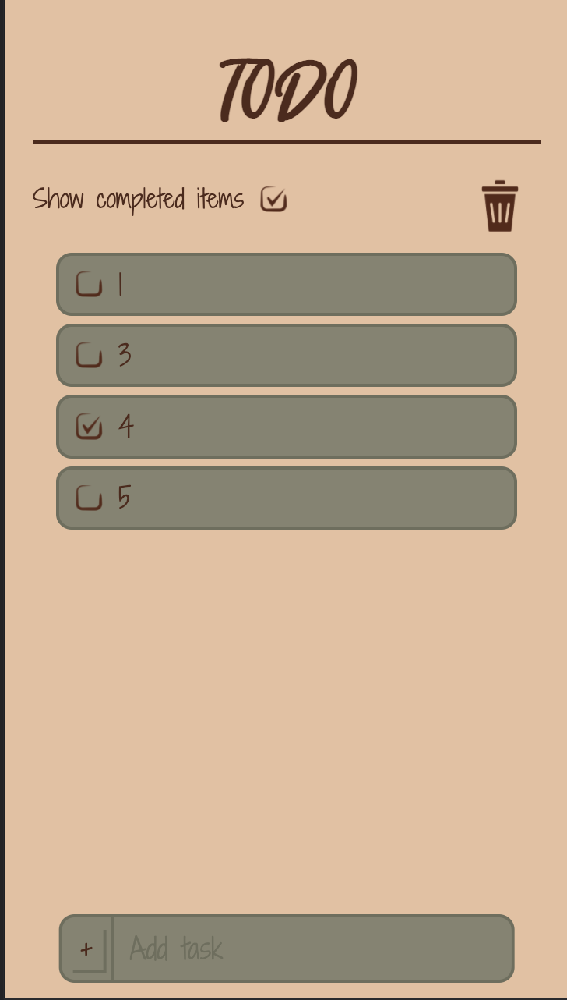
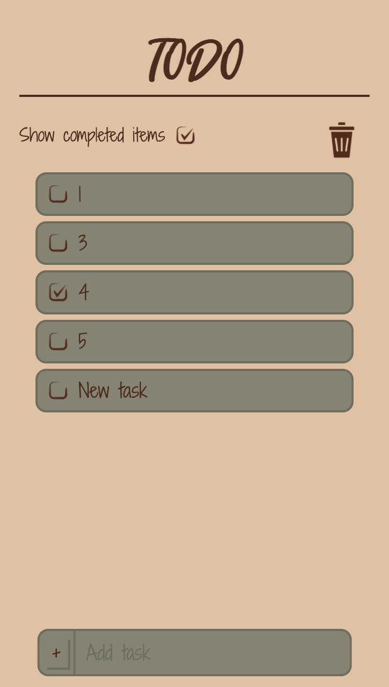
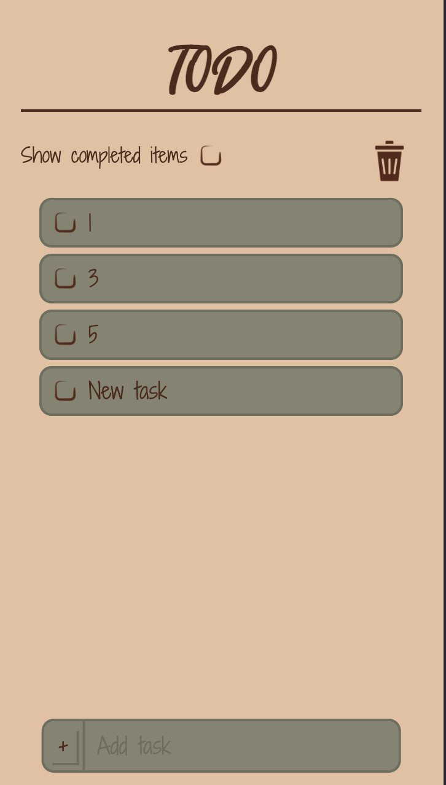
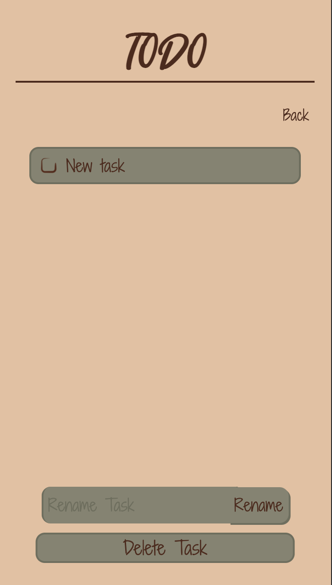
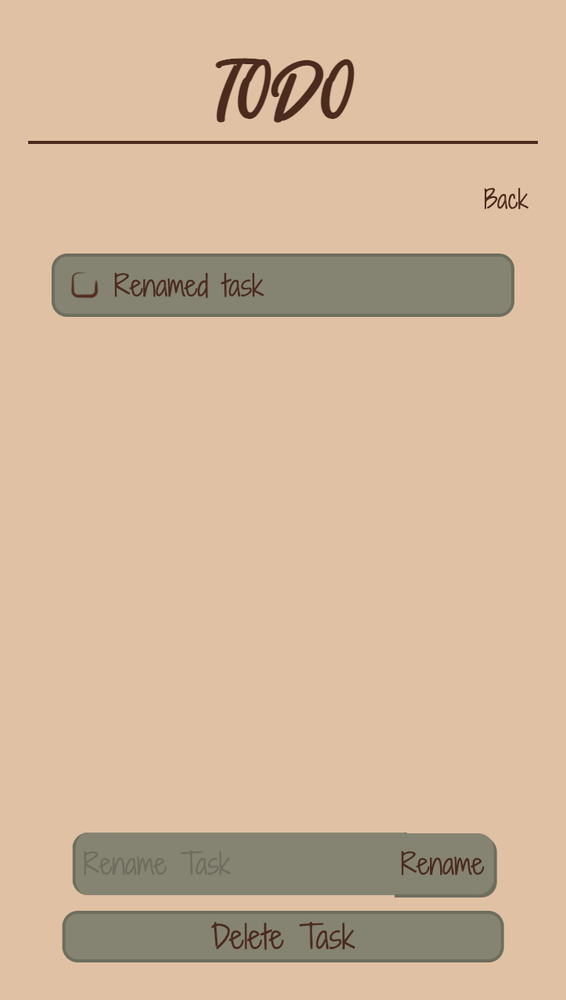
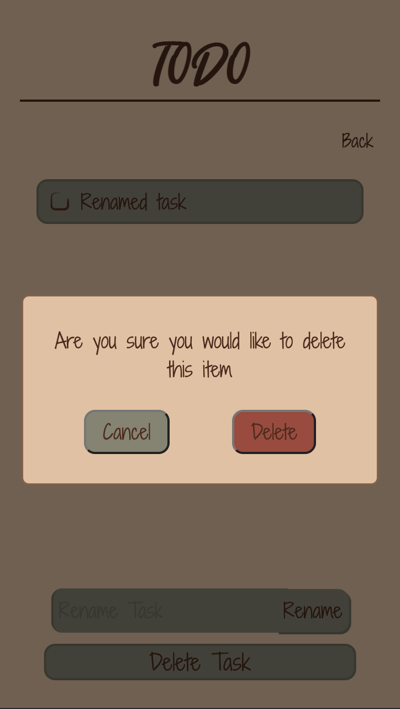
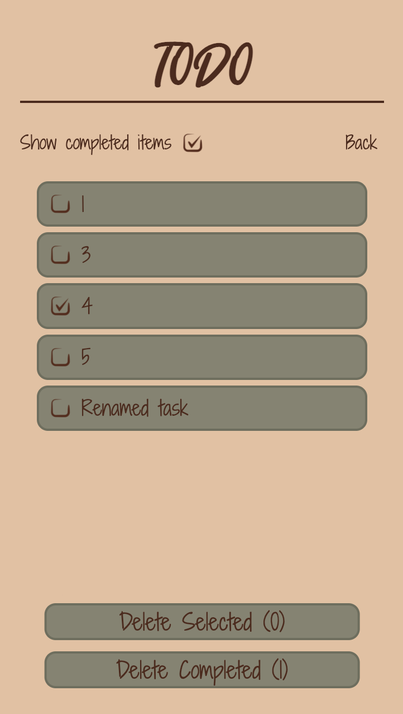
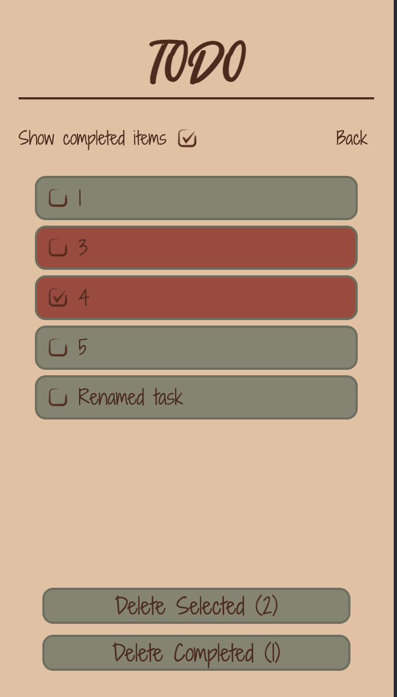
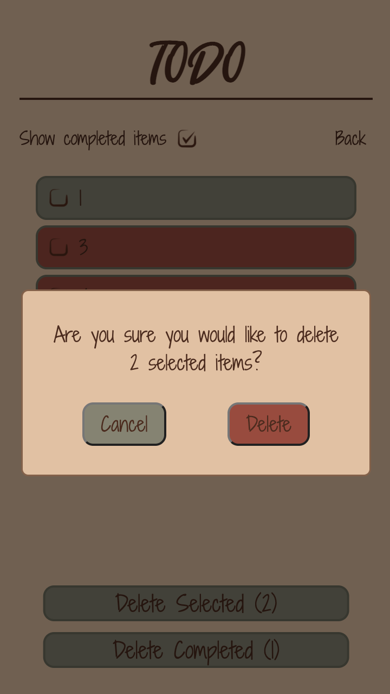

## Design Decisions

We decided early on that we wanted to create an app that felt less tech-y and more natural. This made us think of keywords like 'natural', 'rustic', 'soft', 'hand drawn'.
We chose a rustic forest-themed color palette:

We also chose a few fonts that looked like they fit our theme: Harvest Barn and Shadows Into Light. They both felt more hand-written and natural, while still being simple and readable. Harvest Barn for the title because it's bolder and more stylized, and Shadows Into Light because it's more legible in smaller font sizes.

We wanted a light theme in general, with a tan background and darker list items, in order to give a sense of levity and relaxation rather than a more focused dark theme. The UI is very simple compared to other ToDo lists, with only absolutely essential features available from the home page.

We chose icons that are simple and universally known, and where possible, a little scrappy and informal to fit our theme. So that's our checkboxes and trash can icon.

We rounded off most of our boxes, so that they feel a little less sharp. We tried to keep buttons related to specific tasks on the left (the checkboxes and the + on the add task). We also tried to keep the same general shape and feel to each box.

We decided to float the add task and delete buttons to the bottom, so that they're visually distinct and in a consistent location from the actual current tasks.

## Updated design decisions:
We decided to add a new color to our color palette, a nice rustic-looking red. We needed something to color our selected tasks and confirm delete button to be red, since red is a common color associated with deletion. We wanted the color to be a bit of a dusty, light red to be more aesthetically aligned with our other color choices. We decided not to color our initial delete buttons red, since users are already primed to see buttons at the bottom as delete buttons, and we were afraid that the delete UI would look too red and angry if those buttons were red as well.

We decided to use a checkmark for our logo, since checking tasks is highly related to todo lists and tasks. We decided to use a checked box, since it has the connotation of success and finishing, and symbolizes that users will get things done if they use our app.

We decided to incorporate a delete modal into our app, so that the user is less likely to slip and accidentally delete many of their tasks, especially because we don't currently support deletion undo. The modal gives information about what kind of task you are deleting and how many of that type there are.

We decided to have a scroll bar to see more tasks, as opposed to having multiple pages or making each task smaller so they all fit.

Although we considered hiding the checkbox for show completed items when we enter delete mode, we decided to leave it in both home and delete mode, to provide a more consistent tools layout and give the user more options of what to display at each stage. It should go without saying that edit mode does not require this option.

In delete and edit mode, we render a back button instead of the trashcan icon, to provide the user a clear way home.

### Alternate Designs
We didn't have any other major design ideas. At the beginning we considered going for a more standard style, modern and elegant, but we decided early on that we wanted to do something a little different, and thought that not many ToDo apps have the kind of handwritten design that we were thinking of.

### Updated Alternate Designs

We honestly didn't have any alternate design decisions. We were pretty happy with our initial design so we stuck with that mostly. One alternate design decision we had was we originally had our back button in the edit and delete modes as an X, but we ended up changing that to the words Back instead. This seemed a bit clearer to us. 

### User Testing

No(t yet).

### The final design

We start on our home page. Our default right now is to have 5 tasks, labled 1 through 5, with every other checked off as done. To add a task, we go to the bottom add task input, type in the task name, and click the add button (typing in the Enter button also works to add the task). The task then appears in the todo list, not completed. To check off a task, click the checkmark next to the task. You can also uncheck a task in the same way.

The default for our app is to show completed items, but to hide them, you simply click the checkbox at the top labeled Show completed items.

To edit an item, click on the item (anywhere except the checkbox). This brings you to edit mode, where you can rename the task, delete the task, and also check off the task. To rename it, type the new name into the rename input field and hit the rename button (hitting the enter button also works). You can check/uncheck a task the same way as in the home page. To delete a task, click the delete task button at the bottom of the page. When this happens, a modal pops up to confirm you want to delete the task. If you click delete, the item deletes and you are brought back to the home page. If you click cancel, the task does not delete and you remain in the edit task page. You can use the back button in the top right corner to go back to the home page.

To go to delete mode, click the trash can in the top right corner. Upon clicking it, you are brought to the delete page. You can delete completed items by clicking on that button at the bottom of the page. A modal pops up (just as before) to confirm you want to delete. You can also select items here by clicking anywhere on the item. The selected items are red. And, you can delete these selected items by pressing the delete selected items at the bottom of the page (a delete modal confirms this just like before). There is also a back button on this page, just like in edit mode. 

### Challenges

We had a lot of css troubles. We also struggled a bit with color palette, but eventually decided that what we had was ok for now. Another slight challenge was getting the images to be the right color. They're all black-on-transparent pngs, and we used CSS color filters to rotate them to the color we wanted. We figured this method would be more scalable and flexible if we ever wanted to change color palette in the future.

Finding the icons was also a bit of a challenge, since we had a very specific feel in mind. In the future, we could definitely consider getting a more hand-drawn and natural delete button, but it's hard because a trash-can icon is the most universally recognizable symbol, and at the same time is sort of thematically antithetical to our design keywords. 

### Updated Challenges

Honestly, the biggest challenge we had was dealing with the CSS. Both of us really struggle and don't enjoy stylizing things. Although we already did most of the CSS, we did have to create the modal, and that took us more time than it should have. 

Most of the React was not too difficult for us - we spent a lot more time on our design decisions. For instance, we spent a lot of time debating whether the show completed items checkmark should appear in delete mode (we ended up deciding it should). But making smaller decisions like that were one of harder parts of the lab for us.

We also struggled a bit getting our navigation to work. We had a lot of components, and it was a bit confusing making sure everything appeared correctly. 

We also struggled a bit with getting our to do list to check off correctly. Our design is to have, when you click a checkbox, to have it check off the item, but not in delete mode. In addition, when you click on an item anywhere in delete mode (including the checkbox), it should select the item. It took us a decent amount of time to get this functionality to work correctly (we had to make use of stopPropagation here). 

### Parts we're proud of

We're proud that most of the css looks pretty refined. The add task button doesn't look exactly like we want, but we like the rest of it. We got pretty close to what we actually had in mind, which is cool.

We think the style kind of came together in a nice way. Neither of us have ever just started with a theme and made design decisions and actually had things come together into something relatively cohesive like this. We also really like the type of checkbox we chose and the fact that we got it to be the right color and actually work.

### Parts we're proud of Updated

We're pretty proud of this app. Like it feels relatively functional and easy to use. We're proud of the red color we found and added to our pallette. 

We like the select feature in delete mode where you can specify exactly which tasks to delete. Personally, I (Anna) tend only delete certain tasks from my todo list (not all the completed items), so this functionality is really important to me. 

We also like how, even though our app has a decent amount of functionality, we were able to keep with our rustic theme pretty well. 

keep it along with our theme
