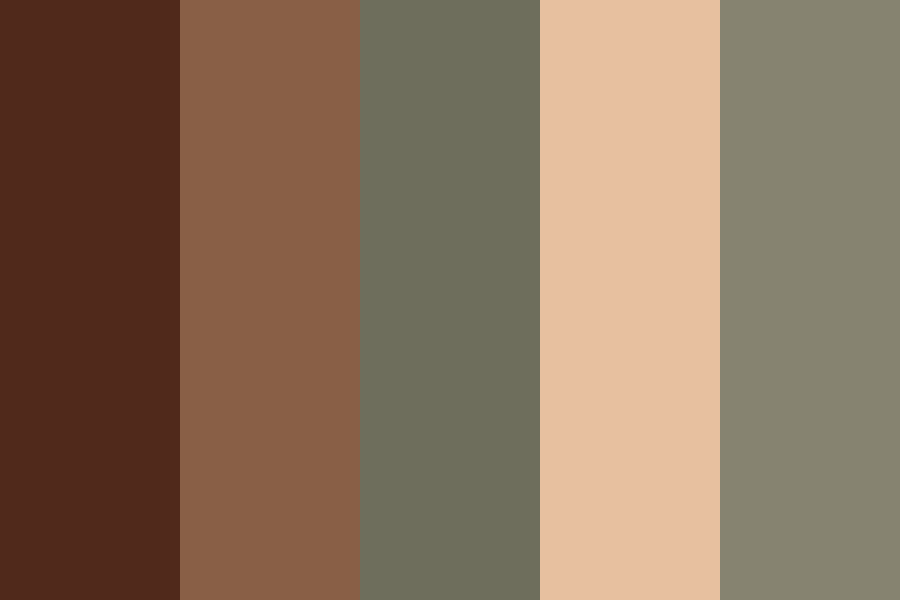

## Design Decisions

We decided early on that we wanted to create an app that felt less tech-y and more natural. This made us think of keywords like 'natural', 'rustic', 'soft', 'hand drawn'.
We chose a rustic forest-themed color palette:

We also chose a few fonts that looked like they fit our theme: Harvest Barn and Shadows Into Light. They both felt more hand-written and natural, while still being simple and readable. Harvest Barn for the title because it's bolder and more stylized, and Shadows Into Light because it's more legible in smaller font sizes.

We wanted a light theme in general, with a tan background and darker list items, in order to give a sense of levity and relaxation rather than a more focused dark theme. The UI is very simple compared to other ToDo lists, with only absolutely essential features available from the home page.

We chose icons that are simple and universally known, and where possible, a little scrappy and informal to fit our theme. So that's our checkboxes and trash can icon.

We rounded off most of our boxes, so that they feel a little less sharp. We tried to keep buttons related to specific tasks on the left (the checkboxes and the + on the add task). We also tried to keep the same general shape and feel to each box.

We decided to float the add task and delete buttons to the bottom, so that they're visually distinct and in a consistent location from the actual current tasks.

### Alternate Designs
We didn't have any other major design ideas. At the beginning we considered going for a more standard style, modern and elegant, but we decided early on that we wanted to do something a little different, and thought that not many ToDo apps have the kind of handwritten design that we were thinking of.

### User Testing

No(t yet).

### Challenges

We had a lot of css troubles. We also struggled a bit with color palette, but eventually decided that what we had was ok for now. Another slight challenge was getting the images to be the right color. They're all black-on-transparent pngs, and we used CSS color filters to rotate them to the color we wanted. We figured this method would be more scalable and flexible if we ever wanted to change color palette in the future.

Finding the icons was also a bit of a challenge, since we had a very specific feel in mind. In the future, we could definitely consider getting a more hand-drawn and natural delete button, but it's hard because a trash-can icon is the most universally recognizable symbol, and at the same time is sort of thematically antithetical to our design keywords. 

### Parts we're proud of

We're proud that most of the css looks pretty refined. The add task button doesn't look exactly like we want, but we like the rest of it. We got pretty close to what we actually had in mind, which is cool.

We think the style kind of came together in a nice way. Neither of us have ever just started with a theme and made design decisions and actually had things come together into something relatively cohesive like this. We also really like the type of checkbox we chose and the fact that we got it to be the right color and actually work.
